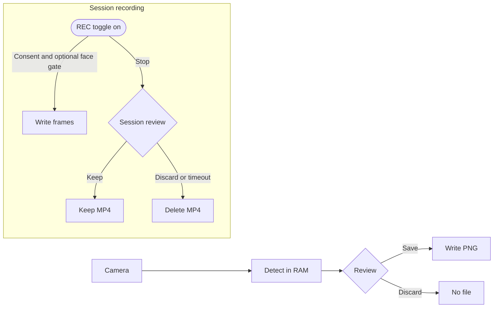
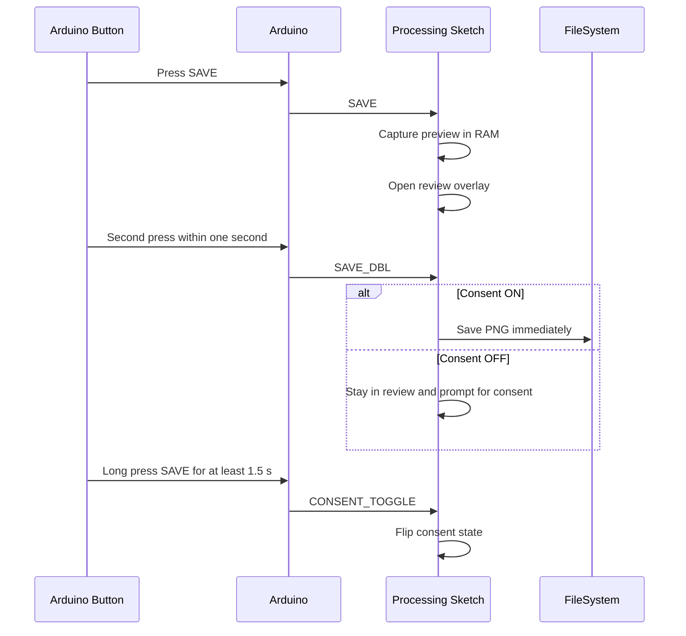

# Face → Slug (Privacy-First) — Teaching Build

A Processing + Arduino sketch that doubles as a workshop kit on community consent and computer vision. This README is the facilitator’s map: it folds technical steps together with prompts from the [Ethics one-pager](ETHICS.md), the [Privacy policy sketch](PRIVACY.md), and the [Assumption Ledger](docs/assumption-ledger.md).

## Why this demo exists

- **Surface the politics of surveillance.** The build lets folks poke at face detection without ever touching recognition, tying back to the [Ethics notes](ETHICS.md) and the [lineage timeline](docs/lineage.md).
- **Practice consent-as-default.** Every capture is opt-in, mirrored by the retention rules in the [Privacy brief](PRIVACY.md).
- **Celebrate community self-expression.** The avatar mode is a love letter to people who’d rather not hand over a headshot.
- **Teach with transparency.** The repo stays detection-only; the [Assumption Ledger](docs/assumption-ledger.md) and [CHANGELOG](CHANGELOG.md) flag the edges.

> Built for STEAM classrooms, community tech clinics, and punk art spaces where ethics, consent, and UX are first-class citizens.

<details markdown="block">
<summary><strong>Educator Mode — logistics, standards, and clock time</strong></summary>

#### Logistics (what you need to pull this off)

- **Gear:** one webcam-enabled laptop running Processing, optional Arduino button deck, projector if you want the room to debug together.
- **Printables:** copies of the [Ethics zine](ETHICS.md) + [Privacy brief](PRIVACY.md) so students can annotate instead of doomscrolling.
- **Room setup:** pods of 2–3 learners with sight lines to the projected screen; tape off a “camera consent zone” so boundaries stay visible.

#### Standards alignment (translate the punk ethos to admin-speak)

- **Minnesota Academic Standards in Science (2019) — Nature of Science and Engineering:** Learners evaluate the societal and ethical trade-offs of proposed engineering solutions when they debate camera usage, retention limits, and consent defaults.
- **Minnesota Academic Standards in the Arts (Media Arts, 2018):** Students refine media artworks that balance intent, audience, and context by iterating on avatar aesthetics and display choices.
- **Minnesota Computer Science Standards (2024) — Impacts of Computing:** Facilitators guide students to analyze how computing innovations shape equity, privacy, and security in local communities.

#### Classroom time cost (because bells still ring)

- **Single block:** 55–65 minutes covers the playlist as written with a brisk demo-to-reflection arc.
- **Two-block deep dive:** 2 × 45 minutes lets you slow down the Arduino build, run peer critiques, and record exit interviews on consent culture.
- **Prep buffer:** budget 20 minutes before class to verify libraries, clear old captures, and stage the avatar assets.

</details>

## Workshop playlist

1. **Consent check-in** — Read the [Ethics zine](ETHICS.md) out loud; ask the group who decides when cameras roll.
2. **Tooling quickie** — Walk through the [Installation guide](INSTALLATION.md) and this README.
3. **Hands-on build** — Run the Processing sketch (below) and wire up the Arduino button panel if you have one.
4. **Data walk** — Trace the `Camera → RAM → Review → (optional) Disk` flow using the Mermaid diagram further down; bring in the [Privacy brief](PRIVACY.md).
5. **Reflection circle** — Compare your observations with the [Assumption Ledger](docs/assumption-ledger.md) and drop new findings into `notes/`.
6. **Next steps** — Use the [Workshop Playbook](docs/workshop-playbook.md) to adapt for your crew.

## Quick start

1. **Processing (Java mode)** → Install libraries via Contribution Manager:
   - **Video** (Processing Foundation)
   - **OpenCV for Processing** (Greg Borenstein)
   - **Video Export** (by *hamoid*)
2. Drop a background image at `processing/data/slug.png` (or lean on the built-in gradient fallback).
3. Open `processing/FaceSlugPrivacyTeaching.pde` in Processing and press ▶️.
4. (Optional) Flash the Arduino sketch `arduino/SaveRecDoubleLongPress/SaveRecDoubleLongPress.ino` and connect a tactile double-press button.
5. Use the on-screen buttons/keys or Arduino signals to explore the save/consent flow.

### macOS-specific prep (welcome to the club)

- **Camera permission pop-up MIA?** macOS sometimes ghosts the first launch. Crack open **System Settings → Privacy & Security → Camera** and toggle Processing ON. Then restart the sketch so the OS hands over the sensor.
- **Continuity Camera heads-up.** If you’re using an iPhone as the webcam, wake/unlock it before flipping consent on; otherwise macOS reports the device but never streams.
- **Virtual cams** (OBS, Zoom, etc.) register fine — the sketch now hunts for names like “OBS Virtual Camera” out of the box.

## When the sketch throws a tantrum (aka troubleshooting)

You’re not cursed; computers are just dramatic. Run through these common trip wires before you sacrifice more coffee to the debugging gods.

### OS & driver purgatory

- **Ancient operating systems**: Windows 7/8 and macOS pre-12 ship crusty media stacks that the Video and OpenCV libraries no longer target. Upgrade the host OS or run the sketch from a newer machine/VM.
- **Half-baked updates**: If you just upgraded macOS or Windows and the camera mysteriously vanished, finish the update (extra restarts, optional security patches) so the OS re-registers AVFoundation / Media Foundation.
- **GPU + camera drivers**: Integrated GPUs starving for updates can crash Processing on launch. Visit Intel/NVIDIA/AMD for current drivers; on macOS this piggybacks the system update.

### Resource bottlenecks

- **Low RAM**: The sketch allocates buffers for live video + avatar assets. Dip below ~4 GB free and Java’s garbage collector will thrash, producing “OutOfMemoryError” in the Processing console. Close Chrome, OBS, or any RAM hoarders before retrying.
- **Disk cliffs**: Session captures write PNGs/MP4s on demand. If the drive is nearly full or sandboxed (hello, school lab profiles), the save dialog will silently fail. Clear space or point the sketch to a writable folder via **File → Preferences → Sketchbook location**.
- **CPU contention**: OBS, Zoom, and browser-based ML demos can hog CPU cycles. When the frame rate tanks, pause those apps or lower their priority so the sketch can breathe.

### Peripheral politics

- **Camera already booked**: If another app (Teams, FaceTime, browser tab) already owns the webcam, Processing just shrugs. Quit the other app or pick a different camera in the sketch’s device picker.
- **USB bus overload**: Daisy-chained webcams + capture cards on an unpowered hub will brown out. Plug the critical camera directly into the machine or use a powered hub.
- **Arduino serial musical chairs**: On Windows the virtual COM port number can bounce. If the optional hardware stops talking, reopen the sketch after checking the correct port in **Tools → Port**.

### Security lockdowns

- **Enterprise admin policies**: School and corporate builds often gate camera access or block unsigned serial drivers. Loop in IT to whitelist Processing and (if needed) install the Arduino drivers with admin privileges.
- **Antivirus crankiness**: Real-time scanners can quarantine the VideoExport temp files. Add the Processing sketch folder to the allowlist.

### VideoExport vs. Processing 4 beef

- **Symptom**: Hitting `REC` flashes red in the console with `NoSuchFieldError` (Processing yells “library incompatible”) and nothing writes.
- **What we do now**: The sketch automatically falls back to a PNG frame stack so workshop momentum survives. Look for a new `sessions/session-*-frames/` folder with a `README.txt` that spells out the `ffmpeg` command (`ffmpeg -framerate 30 -i frame-%05d.png -c:v libx264 -pix_fmt yuv420p session.mp4`).
- **Long-term fix**: Update the Video Export library via Contribution Manager once a Processing 4–compatible release ships. The fallback keeps data minimization intact, but MP4s are still the goal.

Still stuck? Drop notes in `notes/` so future facilitators inherit the wisdom (and the punk spirit).

## Controls

- **Buttons (top bar):** Consent, Avatar, REC, Show my image, Delete now
- **Keys:** `s` (save→review), `y/n` (confirm/discard), `v` (REC), `c` (consent),
  `m` (mirror), `d` (debug), `f` (feather), `g` (gate writes on face), `t` (auto REC on face),
 `A` (avatar), `N` (new avatar), `o` (show last), `Delete` (delete last)
- **Arduino serial:** `SAVE` (first tap), `SAVE_DBL` (second tap ≤1s), `REC` (toggle),
  `CONSENT_TOGGLE` (long-press ≥1.5s)

### No Arduino? No problem.

Running this on a laptop with zero hardware attached is totally valid. The console will drop a
message that reads:

```
No serial ports found — keyboard/mouse controls stay live. Plug in the workshop Arduino and restart when ready.
```

That’s just the sketch letting you know it didn’t detect the optional button board. You can hammer on
the on-screen UI or the keyboard shortcuts and every feature still works.

## Folder structure

```
face-slug-privacy-teaching/
├─ processing/
│  ├─ FaceSlugPrivacyTeaching.pde
│  └─ data/
│     └─ (put slug.png here)
├─ arduino/
│  └─ SaveRecDoubleLongPress/
│     └─ SaveRecDoubleLongPress.ino
├─ notes/
│  └─ HARDWARE_NOTES_PLACEHOLDER.md
├─ diagrams.md
├─ INSTALLATION.md
├─ CHANGELOG.md
├─ LICENSE
└─ .gitignore
```

## Data-flow (high level)



## Serial protocol (gesture semantics)



## License
MIT. See `LICENSE`.

---

## More references & signal boosts

- [INSTALLATION.md](INSTALLATION.md) — step-by-step setup.
- [ETHICS.md](ETHICS.md) — values manifesto.
- [PRIVACY.md](PRIVACY.md) — storage promises.
- [docs/lineage.md](docs/lineage.md) — evolution notes.
- [docs/workshop-playbook.md](docs/workshop-playbook.md) — facilitation prompts and remix ideas.
- [CITATION.cff](CITATION.cff) — academic citation metadata.

**Credits**: OpenCV for Processing (Greg Borenstein), Video Export (hamoid), Processing Foundation.
