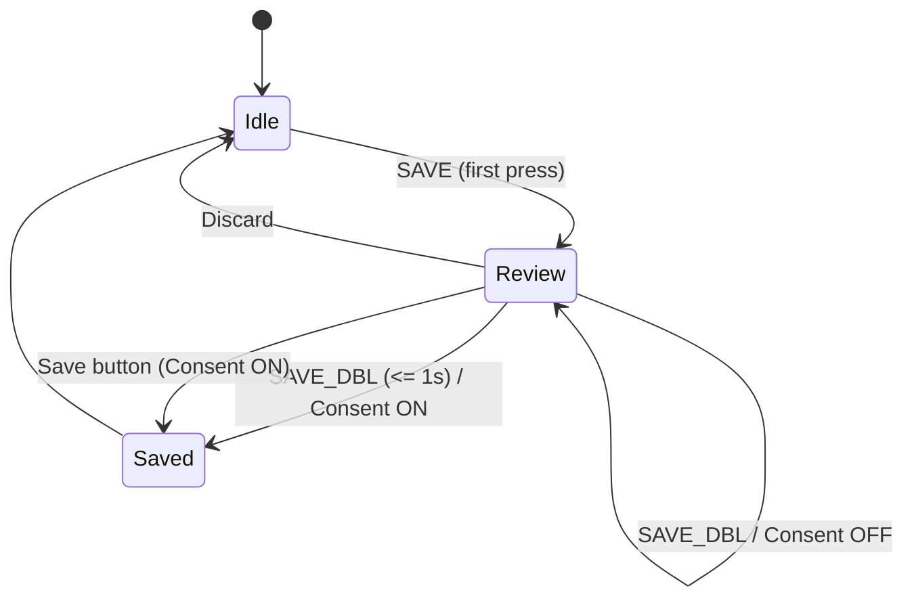

# Diagrams

## A. Save gesture state machine



## B. Recording lifecycle (consent + face-gate)

```mermaid
flowchart LR
  start([REC toggle ON]) --> consent{Consent ON?}
  consent -- No --> start
  consent -- Yes --> gate{Gate on face?}
  gate -- No --> writer[Write frames every draw()]
  gate -- Yes --> present{Face present?}
  present -- Yes --> writer
  present -- No --> start
  writer --> stop([REC toggle OFF])
  stop --> written{Frames written > 0?}
  written -- No --> delete[Delete empty MP4]
  written -- Yes --> review{Session Review Keep/Discard}
  review -- Keep --> keep[Keep MP4]
  review -- Discard/Timeout --> delete
```

## C. Data pipeline

```mermaid
flowchart LR
  camera[[Camera]] --> detect[OpenCV Detect]
  detect --> composite[Composite over Slug]
  composite --> ui[UI Overlays (buttons/map/toasts)]
  ui -->|Consent-gated| disk[(Disk PNG/MP4)]
```

## D. Serial interactions


