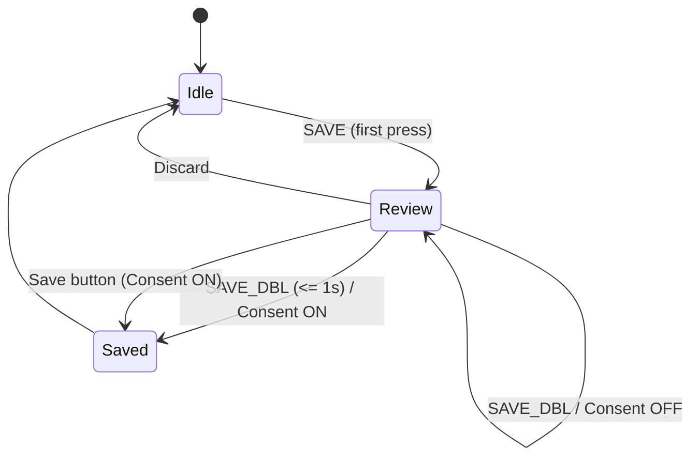
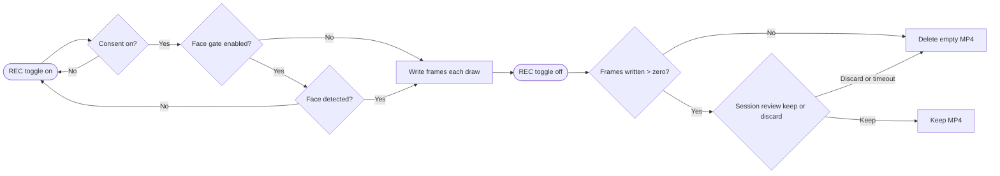
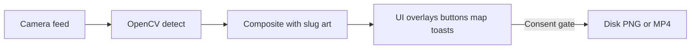

# Diagrams

## A. Save gesture state machine

```mermaid
stateDiagram-v2
  [*] --> Idle
  Idle --> Review : SAVE (first press)
  Review --> Saved : SAVE_DBL (<= 1s) / Consent ON
  Review --> Review : SAVE_DBL / Consent OFF
  Review --> Saved : Save button (Consent ON)
  Review --> Idle  : Discard
  Saved --> Idle
```

## B. Recording lifecycle (consent + face-gate)

```mermaid
graph LR
  start([REC toggle on]) --> consent{Consent on?}
  consent -->|No| start
  consent -->|Yes| gate{Face gate enabled?}
  gate -->|No| writer[Write frames each draw]
  gate -->|Yes| present{Face detected?}
  present -->|Yes| writer
  present -->|No| start
  writer --> stop([REC toggle off])
  stop --> written{Frames written > zero?}
  written -->|No| delete[Delete empty MP4]
  written -->|Yes| review{Session review keep or discard}
  review -->|Keep| keep[Keep MP4]
  review -->|Discard or timeout| delete
```

## C. Data pipeline

```mermaid
graph LR
  camera[Camera feed] --> detect[OpenCV detect]
  detect --> composite[Composite with slug art]
  composite --> ui[UI overlays buttons map toasts]
  ui -->|Consent gate| disk[Disk PNG or MP4]
```

## D. Serial interactions

```mermaid
sequenceDiagram
  participant Arduino
  participant Processing
  participant FS as FileSystem

  Arduino->>Processing: SAVE
  Processing->>Processing: Open Review overlay (RAM only)

  Arduino->>Processing: SAVE_DBL
  alt Consent ON
    Processing->>FS: Write PNG
  else Consent OFF
    Processing->>Processing: Stay in Review
  end

  Arduino->>Processing: CONSENT_TOGGLE
  Processing->>Processing: Flip consent state
```
