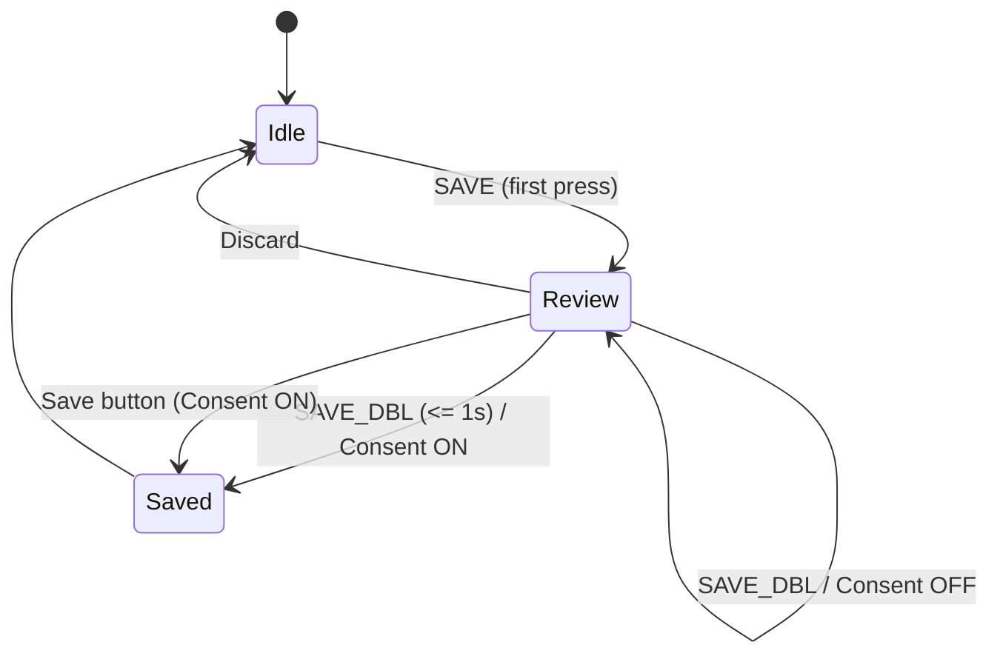

# Diagrams

## A. Save gesture state machine



## B. Recording lifecycle (consent + face-gate)

```mermaid
flowchart TD
  A[REC toggle ON] --> B{Consent ON?}
  B -- "no" --> A
  B -- "yes" --> C{Gate on face?}
  C -- "no" --> D[Write frames every draw()]
  C -- "yes" --> E{Face present?}
  E -- "yes" --> D
  E -- "no" --> A
  D --> F[REC toggle OFF]
  F --> G{Frames written > 0?}
  G -- "no" --> H[Delete empty MP4]
  G -- "yes" --> I[Session Review Keep/Discard]
  I -- "Keep" --> J[Keep MP4]
  I -- "Discard/Timeout" --> H
```

## C. Data pipeline

```mermaid
flowchart LR
  Cam([Camera]) --> CV[OpenCV Detect]
  CV --> Comp[Composite over Slug]
  Comp --> UI[UI Overlays (buttons/map/toasts)]
  UI -->|Consent-gated| Disk[(Disk PNG/MP4)]
```

## D. Serial interactions


